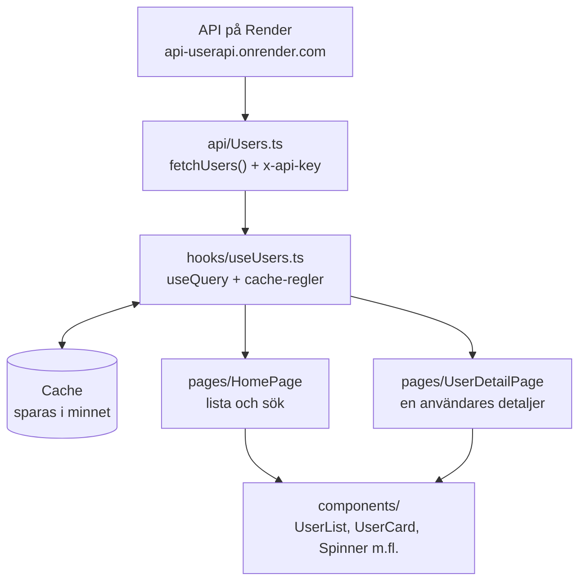
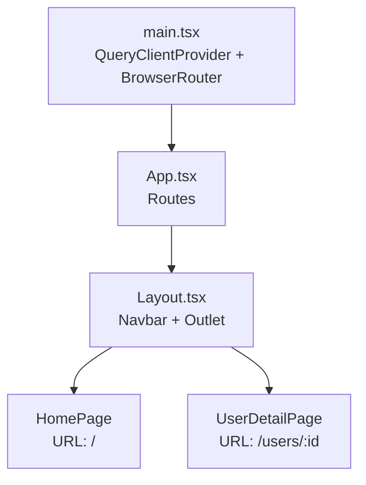

## Architecture

### Data flow

```mermaid
flowchart TD
    API["API på Render<br/>api-userapi.onrender.com"]
    FETCH["api/Users.ts<br/>fetchUsers() + x-api-key"]
    HOOK["hooks/useUsers.ts<br/>useQuery + cache-regler"]
    CACHE[("Cache<br/>sparas i minnet")]
    HOME["pages/HomePage<br/>lista och sök"]
    DETAIL["pages/UserDetailPage<br/>en användares detaljer"]
    COMP["components/<br/>UserList, UserCard, Spinner m.fl."]

    API --> FETCH --> HOOK
    HOOK <--> CACHE
    HOOK --> HOME
    HOOK --> DETAIL
    HOME --> COMP
    DETAIL --> COMP
```

### Routing structure

```mermaid
flowchart TD
    MAIN["main.tsx<br/>QueryClientProvider + BrowserRouter"]
    APP["App.tsx<br/>Routes"]
    LAYOUT["Layout.tsx<br/>Navbar + Outlet"]
    HOME["HomePage<br/>URL: /"]
    DETAIL["UserDetailPage<br/>URL: /users/:id"]

    MAIN --> APP --> LAYOUT
    LAYOUT --> HOME
    LAYOUT --> DETAIL
```